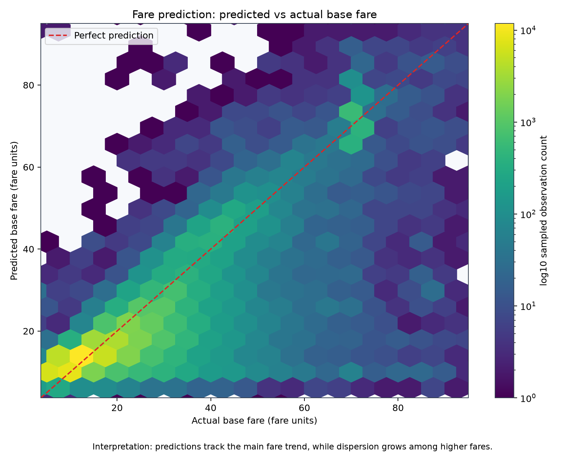
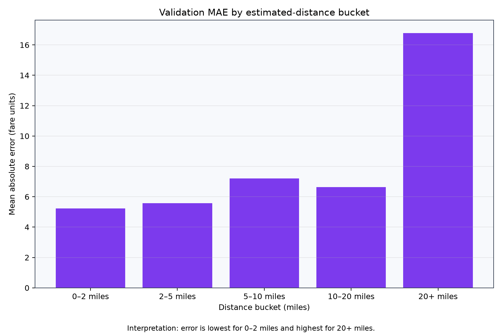
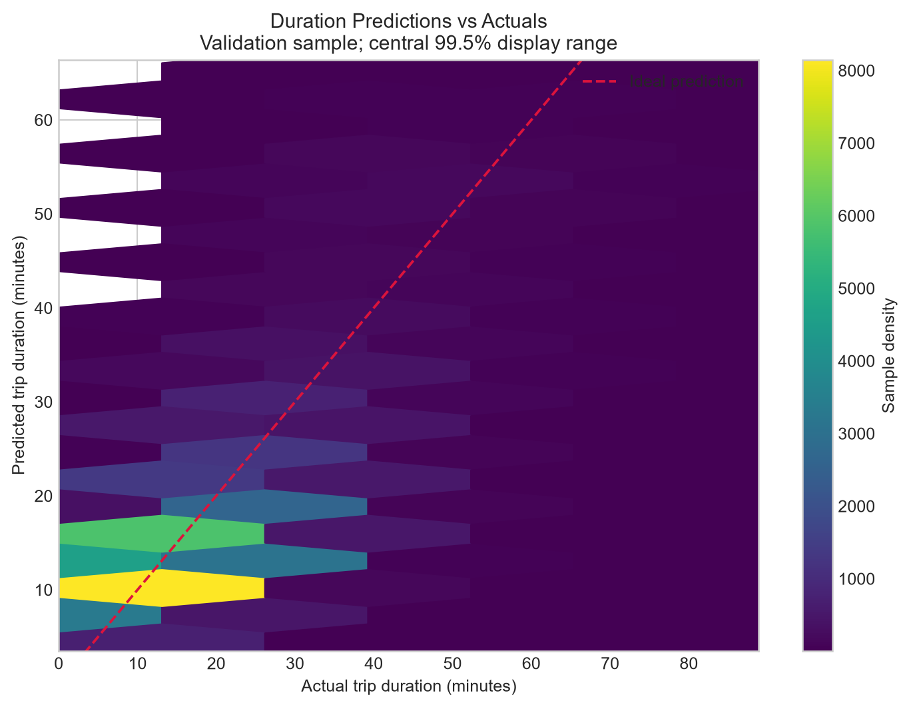
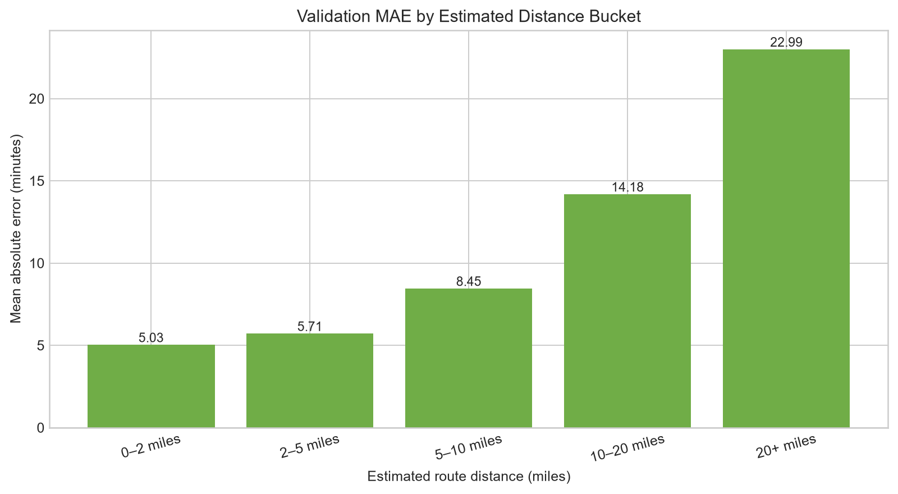
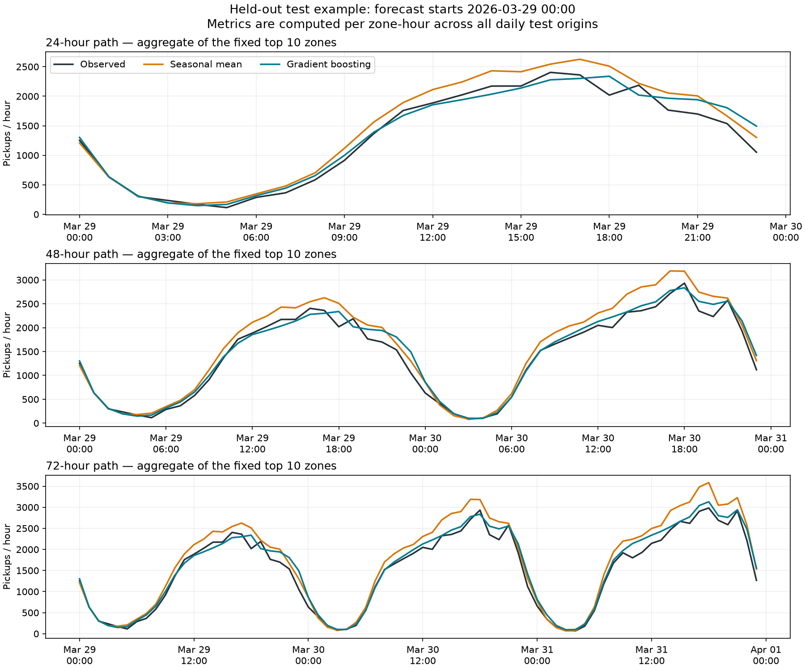
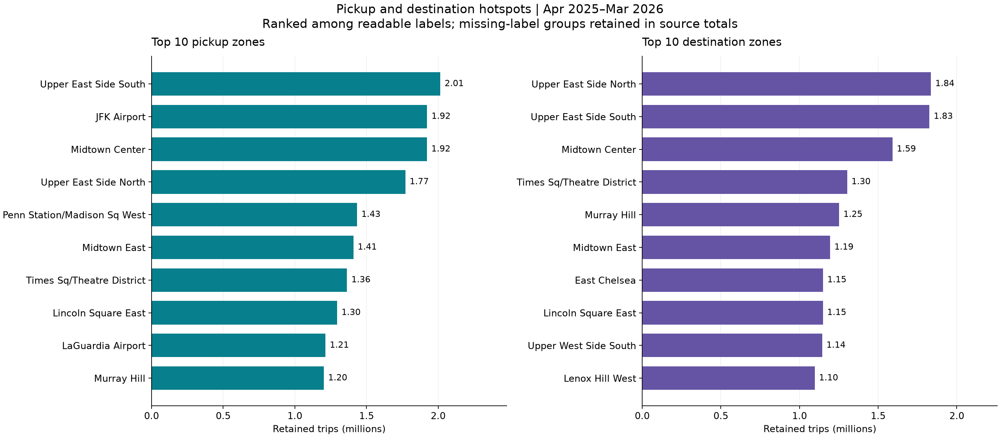
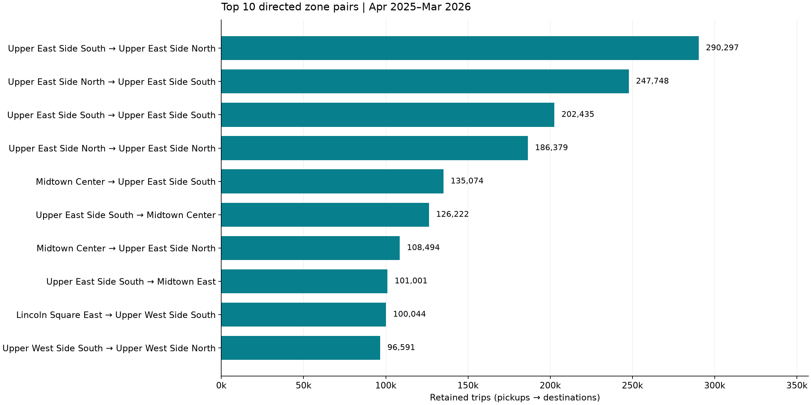
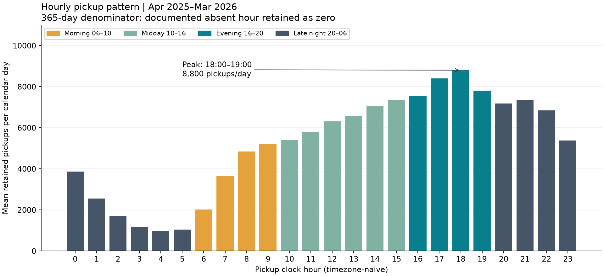
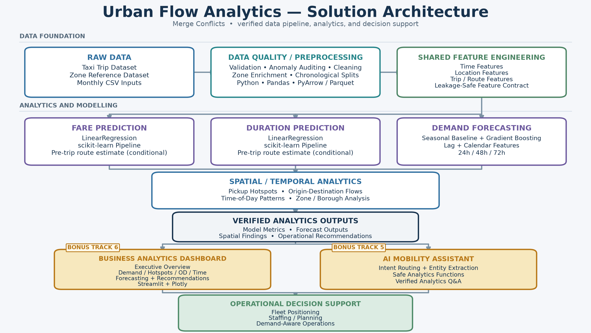

# Merge Conflicts

## Urban Flow Analytics Datathon 2026 — Technical Report

This report documents an integrated taxi-operations analytics solution built from verified competition outputs. The report includes the completed solution architecture and verified final artifacts.

## 1. Executive Summary

Urban taxi operations require decisions at several timescales: quoting a trip before departure, estimating travel time, positioning vehicles for the next operating period, planning staffing over multiple days, and monitoring where passenger movements concentrate. The Merge Conflicts solution connects these decisions through one governed analytical workflow covering **45,533,334 processed trips** from April 2025 through March 2026.

The solution combines four mandatory analytical capabilities. Pre-trip fare prediction achieved a final chronological test MAE of **5.571799**, RMSE of **10.324520**, and R² of **0.676153**. Pre-trip duration prediction achieved a test MAE of **5.802654 minutes**, RMSE of **22.259013 minutes**, and R² of **0.206474**. Both selected models are LinearRegression pipelines and use distance only under the explicit assumption that an estimated route distance is available before departure.

Hourly pickup demand was forecast for 24-, 48-, and 72-hour horizons. Gradient Boosting produced the lowest 24-hour error, while a seasonal baseline was more reliable at 48 and 72 hours. Spatial analysis found strong concentration in Manhattan and major hubs: Upper East Side South led pickup zones, Manhattan-to-Manhattan trips represented **79.58%** of retained records, and normalized evening demand intensity was **2.08 times** morning intensity.

Two secondary interfaces translate these outputs into decision support. A Streamlit dashboard presents executive, hotspot, OD, time-pattern, forecasting, and recommendation views. A deterministic AI mobility assistant answers bounded natural-language questions through predefined analytics functions over a verified reporting snapshot. Together, the components support evidence-based review of dispatch, staging, staffing, and monitoring choices without claiming unmeasured savings or causal business impact.

## 2. Challenge Objective

The Urban Flow Analytics challenge is an operational decision problem built on large-scale taxi trip and zone-reference data. A useful solution must move beyond retrospective description while maintaining a clear boundary between information known before a trip and outcomes observed afterward.

The project therefore pursued six connected objectives:

1. estimate base fare before the trip starts;
2. estimate trip duration before departure;
3. forecast pickup demand over tactical and planning horizons;
4. identify pickup and destination hotspots;
5. describe major directed origin–destination flows and time-of-day differences; and
6. make verified outputs accessible to fleet managers and city officials.

The analytical design emphasizes chronological evaluation, model-view-specific cleaning, leakage control, reproducible feature definitions, and cautious operational interpretation. Predictions and descriptive counts inform decisions; they do not establish vehicle shortages, passenger intent, intervention impact, or financial return on their own.

## 3. Dataset Overview

The source consists of 12 monthly taxi files and a zone reference dataset. Taxi records include pickup and dropoff times, provider and location identifiers, recorded distance, passenger counts, fare components, and operational codes. The zone reference maps `loc_id` to readable borough, zone, and service-zone fields. Origin and destination joins retained the original IDs and did not expand row counts.

The trusted analytical dataset has the following verified properties:

| Property | Value |
|---|---:|
| Processed rows | 45,533,334 |
| Columns | 45 |
| Parquet row groups | 247 |
| Earliest pickup | 2025-04-01 |
| Latest pickup | 2026-03-31 |

Chronological splits preserve future periods for later evaluation:

| Split | Rows | Pickup boundary |
|---|---:|---|
| Train | 31,988,176 | Before 2025-12-11 |
| Validation | 6,814,901 | 2025-12-11 through 2026-02-04 |
| Test | 6,730,257 | 2026-02-05 through 2026-03-31 |
| **Total** | **45,533,334** | 2025-04-01 through 2026-03-31 |

The splits were written incrementally by Parquet row group without shuffling or loading the full processed dataset into pandas memory. Raw, processed, and split competition datasets remain excluded from public Git tracking.

## 4. Data Quality, Cleaning and Feature Engineering

The raw audit covered **48,601,782 rows** before any cleaning decision was applied. The main measured issues were:

| Audited condition | Rows | Percent of raw rows | Analytical treatment |
|---|---:|---:|---|
| Negative `base_fare` | 2,400,031 | 4.938154% | Retain raw; exclude from nonnegative fare modelling |
| Zero distance with nonzero fare | 1,471,746 | 3.028173% | Retain and flag; do not blanket-delete |
| `rider_count == 0` | 231,578 | 0.476480% | Retain without semantic imputation |
| Nonpositive duration | 651,610 | 1.340712% | Exclude from duration/speed model eligibility |
| Speed above 100 mph | 11,899 | 0.024483% | Exclude from time/speed model view; retain raw |
| Historical 2008/2009 timestamps | 8 | 0.000016% | Quarantine from period analysis |
| Either timestamp outside source month | 19,646 | 0.040422% | Preserve legitimate boundaries; review remaining mismatches |

Cleaning followed a view-specific policy. Raw values were preserved, questionable rows were filtered only from tasks for which they were unusable, and ambiguous records remained available with audit flags. Zero-distance trips can reflect waiting or incomplete meter readings, and zero passenger counts show provider-specific recording behavior; neither received unsupported replacement values. Confirmed historical timestamps were not corrected by guessing a year. Most source-month mismatches were legitimate trips crossing midnight at a month boundary. Because anomaly categories overlap, individual counts were not added to estimate unique removals.

Shared engineered fields were `trip_duration_minutes`, `speed_mph` for positive durations, `pickup_date`, `pickup_hour`, `day_of_week`, `month`, `weekend`, and deterministic origin–destination `route_id`. Zone lookups added readable origin and destination labels while retaining location IDs.

Leakage rules excluded dropoff timestamps, prediction targets used as inputs, `speed_mph`, post-trip charges, audit outcomes, and source provenance. Calendar fields were derived only from pickup/request time. **The final fare and duration models use `distance_miles` only under the assumption that it represents an estimated route distance available before departure; actual completed-trip mileage is not a valid pre-trip feature.** Chronological train, validation, and test membership was fixed before modelling.

## 5. Fare Prediction

### Method

Fare prediction targets `base_fare`. The selected estimator is `LinearRegression` within a scikit-learn `Pipeline`. A `ColumnTransformer` applies median imputation to numeric fields and most-frequent imputation followed by `OneHotEncoder(handle_unknown="ignore")` to categorical fields. Keeping preprocessing inside the pipeline applies the training-fitted transformations consistently at inference time.

The final route-estimate configuration uses eight inputs:

- numeric: `pickup_hour`, `month`, and conditional `distance_miles`;
- categorical: `provider_code`, `day_of_week`, `weekend`, `origin_loc_id`, and `dest_loc_id`.

The strict pre-trip fallback excludes distance when no reliable route estimate exists. A `route_id` experiment stopped before model fitting because one-hot preprocessing created **22,392 encoded features**, exceeding the predefined 5,000-feature safety threshold.

### Validation comparison

| Model | MAE | RMSE | R² |
|---|---:|---:|---:|
| Median baseline | 11.713890 | 19.724010 | -0.148117 |
| LinearRegression without distance | 8.689478 | 13.928211 | 0.427485 |
| RandomForest | 9.209341 | 14.128331 | 0.410915 |
| ExtraTrees | 9.106238 | 14.121436 | 0.411490 |
| **LinearRegression with conditional distance** | **5.737909** | **10.986343** | **0.643793** |

The conditional-distance model reduced validation MAE by **2.951569**, or **33.967%**, relative to LinearRegression without distance. The fixed RandomForest and ExtraTrees candidates did not outperform the simpler strict LinearRegression configuration.

### Final evaluation

| Dataset | Rows | MAE | RMSE | R² |
|---|---:|---:|---:|---:|
| Validation | 6,814,901 | 5.737909 | 10.986343 | 0.643793 |
| Final test | 6,730,257 | 5.571799 | 10.324520 | 0.676153 |

Final fitting used **445,000 deterministic train rows** and **97,500 deterministic validation rows**, totaling **542,500**. Sampling selected up to 2,500 evenly spaced positions from each Parquet row group. The test split was streamed once after model selection, and no features or parameters changed afterward. Serialization later recreated the same documented fit without reopening test data.



The central validation distribution follows the diagonal, while residual variation grows across harder trips.



Distance-stratified error provides a practical check on where route-estimate predictions require more monitoring.

## 6. Trip Duration Prediction

Duration prediction targets `trip_duration_minutes` and uses the same pipeline structure and eight conditional route-estimate features as fare prediction. The strict fallback again excludes distance.

### Validation comparison

| Model | MAE (minutes) | RMSE (minutes) | R² |
|---|---:|---:|---:|
| Median baseline | 9.756819 | 26.446473 | -0.024739 |
| LinearRegression without distance | 8.566630 | 24.971912 | 0.086347 |
| RandomForest | 8.708620 | 25.046847 | 0.080855 |
| ExtraTrees | 8.696595 | 25.090268 | 0.077666 |
| **LinearRegression with conditional distance** | **6.367238** | **23.700579** | **0.177008** |

Conditional distance improved validation MAE by **2.199392 minutes (25.674%)** and RMSE by **1.271333 minutes (5.091%)** over LinearRegression without distance. Both tested tree ensembles were slower and slightly less accurate than the simpler model under the fixed first-pass comparison.

### Final evaluation and error behavior

| Dataset | Rows | MAE (minutes) | RMSE (minutes) | R² |
|---|---:|---:|---:|---:|
| Validation | 6,814,901 | 6.367238 | 23.700579 | 0.177008 |
| Final test | 6,730,257 | 5.802654 | 22.259013 | 0.206474 |

Final fitting used the same **445,000 train + 97,500 validation = 542,500 rows** sampling design. The test split was evaluated once after selection. Test MAE and RMSE improved relative to validation, and R² increased by 0.029466; no model change followed this result.

Validation MAE was lowest at **02:00 (4.798572 minutes)** and highest at **05:00 (8.602170 minutes)**. The **0–2 mile** bucket had the lowest MAE at **5.028460 minutes**, while **20+ miles** had the highest at **22.991634 minutes**.



The model follows typical trips more closely than extreme durations.



Error rises substantially with estimated distance. The maximum validation duration was **8,611.866667 minutes**, and **9,158 validation trips (0.134382%)** exceeded 120 minutes. These values were retained unchanged. Their large residuals disproportionately affect RMSE and help explain why duration R² remains modest.

## 7. Demand Forecasting

Demand is defined as hourly pickup count. Forecasting used a continuous hourly grid for the ten highest-volume pickup zones and preserved the documented missing global hour as zero rather than inferring a timezone correction. The evaluation used chronological windows and **53 daily test origins** for each horizon.

The seasonal baseline uses repeated historical seasonality. The improved candidate is Gradient Boosting with lag features (`lag_1`, `lag_24`, `lag_48`, `lag_168`), rolling means, hour, weekday, weekend, and zone code. Recursive forecast paths do not use future observed demand.

| Horizon | Seasonal baseline MAE | Gradient Boosting MAE | Seasonal baseline RMSE | Gradient Boosting RMSE | Winner |
|---:|---:|---:|---:|---:|---|
| 24h | 33.603788911 | 32.302992781 | 53.826564740 | 52.090000550 | Gradient Boosting |
| 48h | 33.574418557 | 34.268282886 | 53.772857929 | 55.024541569 | Seasonal Baseline |
| 72h | 33.571390821 | 35.188656381 | 53.751538591 | 56.369612289 | Seasonal Baseline |

Errors are pickups per zone-hour across each horizon's first H predictions. Gradient Boosting offers the best tested 24-hour reference for tactical next-day dispatch. At 48 and 72 hours, the seasonal baseline provides the lower-error reference for staffing and broader planning. Forecast method therefore remains horizon-specific.



The saved forecast outputs cover April 1–3, 2026 and are archived projections, not live predictions or observed deployment outcomes.

## 8. Spatial-Temporal and OD Analysis

Demand is strongly concentrated in a small number of readable pickup zones:

| Rank | Pickup zone | Retained pickups |
|---:|---|---:|
| 1 | Upper East Side South | 2,014,915 |
| 2 | JFK Airport | 1,923,134 |
| 3 | Midtown Center | 1,922,045 |



The leading directed readable zone flow is **Upper East Side South → Upper East Side North**, with **290,297 trips**. The reverse direction contains 247,748 trips, a difference of 42,549 across the year. Same-zone pairs indicate shared zone labels, not that a vehicle remained at one physical point.



At borough level, **Manhattan → Manhattan** accounts for **36,234,761 trips**, or **79.58%** of retained records. These counts describe occupied passenger movements; they do not measure empty-vehicle availability or unmet demand.

Time-window normalization reveals a second operational pattern:

| Window | Retained trips | Mean pickups per nominal hour |
|---|---:|---:|
| Morning, 06:00–10:00 | 5,724,154 | 3,920.65 |
| Midday, 10:00–16:00 | 14,045,862 | 6,413.64 |
| Evening, 16:00–20:00 | 11,883,847 | 8,139.62 |
| Late night, 20:00–06:00 | 13,879,471 | 3,802.59 |

Evening intensity is **2.08 times** morning intensity. Late-night total volume is larger than evening volume because the late-night window spans ten hours; its hourly intensity is lower. The busiest clock hour is 18:00–19:00, with 3,211,841 annual pickups.



## 9. Model Evaluation and Comparison

Three regression metrics provide complementary views:

- **MAE** is the average absolute error in the target's original units and is straightforward to interpret operationally.
- **RMSE** squares errors before averaging, so rare large misses receive more weight. The distinction is especially relevant to the duration tail.
- **R²** measures the share of target variability explained relative to a mean predictor. It is reported for fare and duration regression, but not for demand forecasting because the forecasting evaluation did not produce it.

Chronological validation ensures later periods do not influence earlier model selection. Validation determined the estimator and features; the held-out test period was then used once for final fare and duration reporting.

| Task | Selected configuration | Validation MAE | Test MAE | Validation RMSE | Test RMSE | Validation R² | Test R² |
|---|---|---:|---:|---:|---:|---:|---:|
| Fare | LinearRegression + conditional distance | 5.737909 | 5.571799 | 10.986343 | 10.324520 | 0.643793 | 0.676153 |
| Duration | LinearRegression + conditional distance | 6.367238 | 5.802654 | 23.700579 | 22.259013 | 0.177008 | 0.206474 |

| Forecast horizon | Selected method | Selected MAE | Selected RMSE |
|---:|---|---:|---:|
| 24h | Gradient Boosting | 32.302992781 | 52.090000550 |
| 48h | Seasonal Baseline | 33.574418557 | 53.772857929 |
| 72h | Seasonal Baseline | 33.571390821 | 53.751538591 |

The comparisons favor simple linear regression for the selected supervised feature sets and different demand methods by horizon. They do not establish that these choices dominate untested models or future operating regimes.

## 10. Business Findings and Operational Recommendations

The following actions preserve the scope and cautions of the verified spatial and forecasting findings:

1. **Review staging capacity in Upper East Side South.** It is the first-ranked pickup zone with **2,014,915 retained pickups (4.43%)**. Use observed queues and utilization to size any deployment; trip counts alone do not establish a vehicle shortage.

2. **Emphasize evening dispatch review in Midtown Center.** The zone records **629,425 pickups from 16:00–20:00**, while network evening intensity is 8,139.62 pickups per nominal hour versus 3,920.65 in the morning.

3. **Keep late-night coverage under review for Upper East Side South → Upper East Side North.** This is the leading readable late-night pair with **46,364 trips**. Interpret late-night totals in the context of the ten-hour window rather than allocating resources from total volume alone.

4. **Monitor both directions of the Upper East Side South ↔ Upper East Side North flow.** The leading direction has 290,297 trips versus 247,748 in reverse. Check time-specific vehicle availability before repositioning empty vehicles; annual occupied-trip imbalance is not a fleet-balance measure.

5. **Use a horizon-specific forecast reference.** Start with Gradient Boosting for 24-hour dispatch and the seasonal baseline for 48-/72-hour staffing and planning, subject to ongoing monitoring. This policy follows observed held-out error and is not an independently validated deployment intervention.

These recommendations prioritize where operational teams should investigate and monitor. No savings, service-level gain, fleet quantity, or ROI is inferred.

## 11. Bonus Track 6 — Business Analytics Dashboard

The Streamlit dashboard turns verified analytical outputs into five management views:

1. **Executive Overview** — retained-trip, hotspot, Manhattan-flow, and forecast indicators;
2. **Demand and Hotspots** — pickup and destination rankings plus hourly and weekday patterns;
3. **OD and Time Patterns** — directed routes, operating windows, and borough movement;
4. **Forecasting** — horizon and zone selectors with both saved forecast paths and exact held-out metrics; and
5. **Recommendations** — the five evidence-linked operational actions.

The app uses a checksum-validated bundle of small reporting files rather than raw trips, Parquet datasets, or model fitting. It separates historical analysis, held-out forecast evaluation, and archived April 2026 forecast outputs. Selectors, tooltips, and downloads help managers examine the evidence while labels explain truncated OD extracts and other interpretation limits.

## 12. Bonus Track 5 — AI Mobility Assistant

The AI mobility assistant provides a bounded natural-language layer over the same verified reporting snapshot:

```text
Natural-language question
        → deterministic intent routing
        → entity extraction
        → safe predefined analytics function
        → verified bundled analytics inputs
        → plain-English answer
```

Supported topics include hotspots, hourly and weekday demand, borough demand, overall and time-window OD routes, forecast comparisons, saved zone forecasts, and operational recommendations. The assistant does not execute arbitrary Python, produce unrestricted SQL, access raw taxi data, or depend on model artifacts. Unsupported questions are rejected clearly; ambiguous requests trigger clarification; unknown zones receive bounded suggestions. This bonus interface remains secondary to the validated mandatory analysis.

## 13. Solution Architecture

The logical architecture separates governed data preparation from analytical outputs and user-facing interfaces:

```text
Raw Taxi Data + Zone Reference
              → Validation / Cleaning
              → Shared Feature Engineering
              → Fare Model | Duration Model | Demand Forecast
              → Spatial / OD Analytics
              → Verified Analytics Outputs
              → Dashboard | AI Assistant
              → Operational Decision Support
```



*Figure: End-to-end Urban Flow Analytics solution architecture.*

The diagram preserves the verified flow from confidential raw inputs through preprocessing, shared features, predictive and forecasting analytics, spatial analysis, verified outputs, and the two bonus decision-support interfaces.

## 14. Limitations

- `distance_miles` is deployable only when supplied by a valid pre-trip route estimator. The experiment used stored distance as a proxy; completed-trip mileage cannot be assumed available before pickup.
- Fare and duration fitting used deterministic samples—445,000 train rows and 97,500 validation rows—rather than all approximately 39 million train-plus-validation records.
- The duration target has a heavy long-duration tail that materially increases RMSE and limits explained variance.
- Traffic, congestion, weather, incidents, road conditions, and live fleet availability are not fully represented.
- The continuous demand grid contains one documented missing global hour, 2026-03-08 02:00, retained as zero without an inferred timezone correction.
- Forecasting performance varies materially by horizon. The ten-zone cohort was selected retrospectively, and evaluation windows overlap.
- OD zone reporting extracts are truncated to leading pairs; absence from an extract does not mean zero demand.
- Competition-data confidentiality prevents public distribution of raw, processed, and split taxi datasets.
- Observational demand and OD counts do not establish causal trip purpose, unmet demand, or the impact of a future deployment policy.

## 15. Conclusion

The solution links data-quality controls, leakage-safe features, predictive models, demand forecasts, and spatial evidence in one reproducible workflow. The processed dataset supports consistent chronological evaluation; simple LinearRegression pipelines provide the strongest tested fare and duration results under the route-distance assumption; forecasting selects different methods for tactical and planning horizons; and spatial analysis identifies where and when retained demand concentrates.

The dashboard and deterministic assistant make these outputs accessible without rerunning confidential large-scale analysis or exposing arbitrary query execution. The result is a grounded decision-support foundation for staging, dispatch, staffing, and monitoring. Its recommendations remain review points supported by observed data rather than guarantees of financial or operational improvement.

---

### Report provenance

All values in this report come from the verified project handovers, cleaning policy, feature contract, forecasting metrics, spatial findings, completed notebooks, and integrated final notebook. No model was retrained, no final test was reevaluated, and no forecast was recomputed while preparing this report source.
